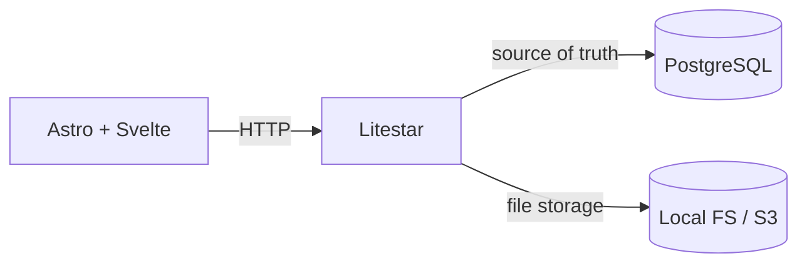

# Concilia Architecture

This directory defines Concilia architecture, stable operating rules and domain boundaries that must remain aligned with implementation.

## Project Map

The project separates runtime code, living architecture, decision records, technical status and generated evidence.

- `AGENTS.md`: agent operating rules.
- `lat.md/`: architecture invariants and canonical policies.
- `SrvRestAstroLS_v1/backend/`: Litestar backend.
- `SrvRestAstroLS_v1/clientA/`: Astro 7 + Svelte 5 frontend.
- `SrvRestAstroLS_v1/docs/`: current and historical runtime status.
- `docs/adr/`: architecture decision records.
- `data/`: approved inputs, derived data and reports.
- `storage/`: raw data lake (incoming, canonical, archives).

## Stack

The stack uses explicit boundaries between the web application, persistent truth and external services.

- Litestar with Python 3.11+;
- Astro 7 and Svelte 5;
- PostgreSQL as source of truth;
- No vector index currently (Milvus not integrated);
- No LLM gateway currently (LiteLLM not integrated);
- Playwright + Chromium as browser gate.

## Architecture

The runtime keeps PostgreSQL authoritative for reconciliation state, uploads, canonical parquets and audit trails.

## Conventions

Stable naming and entrypoint conventions prevent project identity from leaking across repositories.

- visible brand: `Concilia FCE`;
- technical identifier: `concilia`;
- environment prefix: `CONCILIA_`;
- backend port: `7058`;
- frontend port: `3058`;
- ASGI entrypoint: `SrvRestAstroLS_v1/backend/ls_iMotorSoft_Srv01.py`;
- no `backend/app.py` without ADR.

## External Services

PostgreSQL is a permanent external service and is never managed automatically by agents.

Service-dependent work follows [[service-preflight-methodology]].

## Canonical Documents

Each architecture concern has one canonical LAT source and may be anchored from code with `@lat`.

- [[global-configuration-facade-policy]]
- [[lat-documentation-policy]]
- [[postgres-driver-policy]]
- [[authentication-security-policy]]
- [[tenant-context-authorization-policy]]
- [[frontend-implementation-policy]]
- [[reconciliation-scope-contract]]
- [[sicom-integration-policy]]
- [[wizard-runtime-policy]]
- [[pdf-excel-extraction-policy]]
- [[service-preflight-methodology]]
- [[browser-mcp-validation-policy]]
- [[root-cause-debugging-policy]]
- [[mermaid-diagram-policy]]
- [[concilia-knowledge-map]]
- [[status_actual]]

## Configuration Guardrail

Global configuration has a single backend reader and a public-only frontend facade.

Before changing environment variables, auth settings, PostgreSQL, `globalVar.py` or `global.js`, read [[global-configuration-facade-policy]].

## Development Flow

Development begins from current repository state and loads only the canonical context required by the task.

1. Read `AGENTS.md` and `SrvRestAstroLS_v1/docs/status_actual.md`.
2. Check branch and worktree state.
3. Read the relevant LAT or ADR source.
4. Keep changes scoped and preserve unrelated work.
5. Run focused validation, `git diff --check` and `lat check` when applicable.

## Status Convention

Status files describe current closing state; they do not duplicate architecture or serve as an append-only diary.

- runtime current state: `SrvRestAstroLS_v1/docs/status_actual.md`;
- frozen runtime history: `SrvRestAstroLS_v1/docs/status_historico_hasta_YYYY-MM-DD.md`;
- architecture current state: `lat.md/status_actual.md`.

## Completion Criteria

A phase closes only when implementation, documentation and validation agree and limitations are recorded explicitly.

No HTTP 200, previous status entry or exploratory browser run is sufficient by itself to declare a functional PASS.