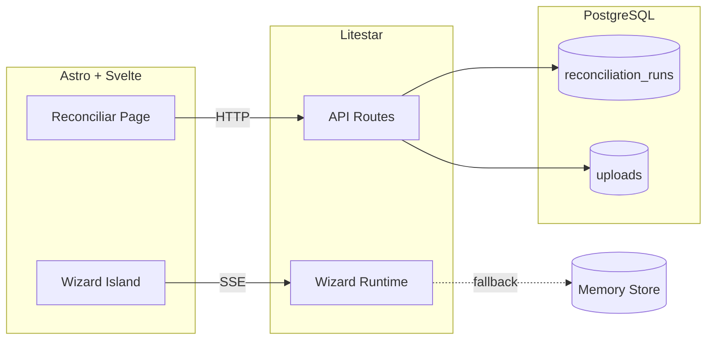
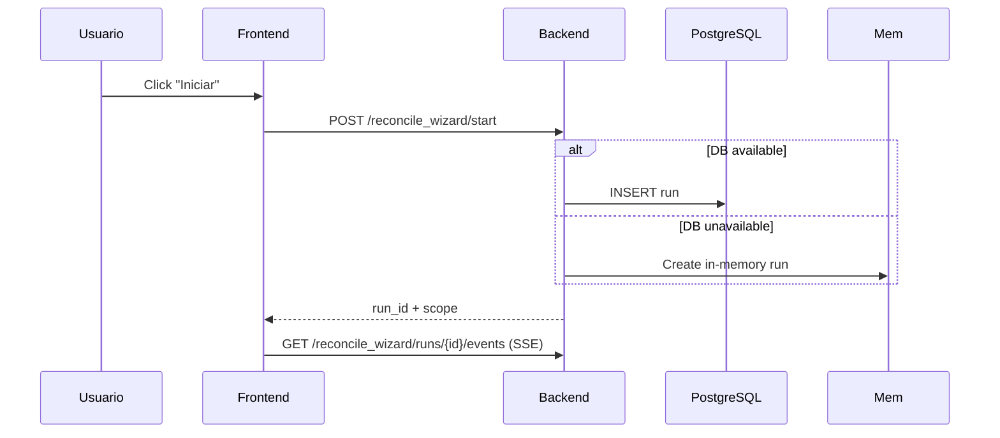
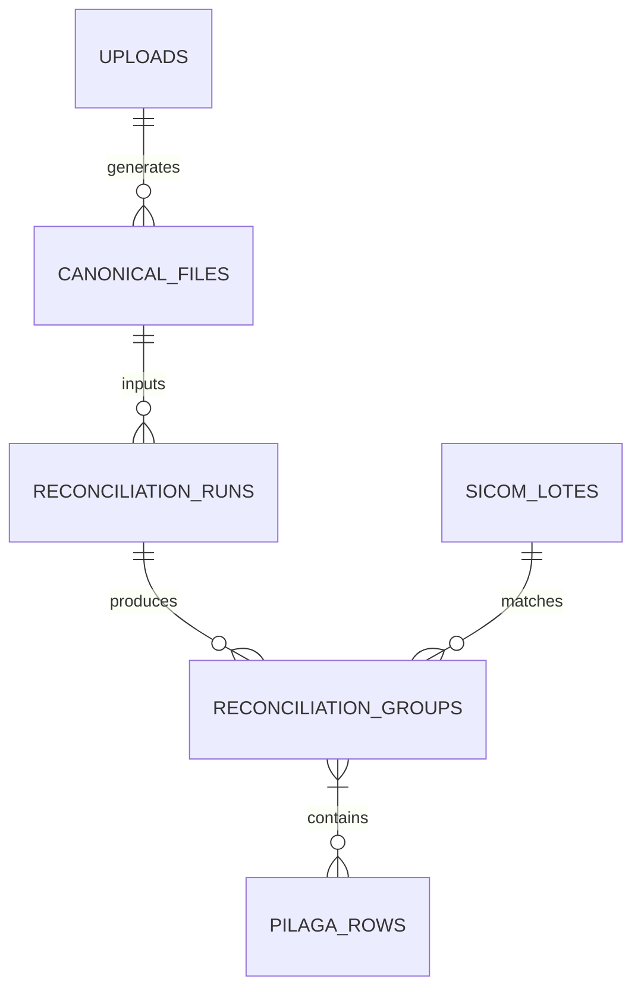

# Mermaid Diagram Policy

This policy governs architecture and flow diagrams in Concilia documentation.

## Tooling

- **Source**: Mermaid (`.mmd` or fenced in `.md`)
- **Render**: GitHub-native + `mmdc` CLI for local preview
- **Format**: `flowchart`, `sequenceDiagram`, `erDiagram`, `classDiagram`

## Conventions

### Flowcharts



- Direction: `LR` (left-right) for architecture, `TD` for sequences
- Subgraphs for logical boundaries
- Dashed `-.->` for fallback/async paths
- Solid `-->` for sync HTTP/RPC

### Sequence Diagrams



### ER Diagrams



## Location

- **Architecture**: `lat.md/lat.md` (top-level)
- **Feature flows**: In relevant LAT policy (e.g., `wizard-runtime-policy.md`)
- **Data model**: `lat.md/concilia-knowledge-map.md`
- **ADRs**: Embedded in `docs/adr/ADR-XXX.md`

## Validation

```bash
# Local preview
npx -p @mermaid-js/mermaid-cli mmdc -i diagram.mmd -o diagram.svg

# CI check (syntax only)
npx -p @mermaid-js/mermaid-cli mmdc -i lat.md/lat.md -o /dev/null
```

## Forbidden

- PlantUML, GraphViz, Draw.io, Lucidchart sources
- Diagrams without source (no `.mmd` or fenced block)
- Diagrams in docs that drift from code (review in PR)
- Color-dependent meaning (use shape/label)